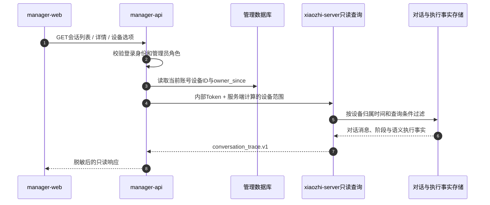

## 内容要求

### 格式约束

- **内容规范**: 完整句无需额外换行，在一行直接构建

**错误示例**：

```
模糊调节入口（例如“帮我调”“请帮我调整一下”）使用共享的词法语法识别，而不是维护完整
短语白名单。语法由可组合的礼貌前缀、调节动作词、语气后缀和明确对象排除组成；新增表达时
只需扩展动作词或字段别名，后续组合会自动覆盖。没有明确按摩对象时先进入“等待调节字段”
状态并追问力度、部位或时长，带有“空调”“音量”等明确非按摩对象的句子不会被该候选截获。
```

**正确示例**

```
模糊调节入口（例如“帮我调”“请帮我调整一下”）使用共享的词法语法识别，而不是维护完整短语白名单。语法由可组合的礼貌前缀、调节动作词、语气后缀和明确对象排除组成；新增表达时只需扩展动作词或字段别名，后续组合会自动覆盖。没有明确按摩对象时先进入“等待调节字段”状态并追问力度、部位或时长，带有“空调”“音量”等明确非按摩对象的句子不会被该候选截获。
```

- **标题要求**: 使用 `##` 作为标题级别。
- **名称解释**: 流程图、时序图中使用的节点名称、功能流程应有统一说明用途

示例：

"""
- manager-web: 管理前端
- manager-api: 管理API
- xiaozhi-server只读查询: 服务端只读查询用于查询对话与执行事实
- 对话与执行事实存储: 对话与执行事实存储用于存储对话与执行事实


"""

### 流程表达

- **格式要求**: 涉及流程表达时优先使用 mermaid 格式的时序图、流程图来表达。

